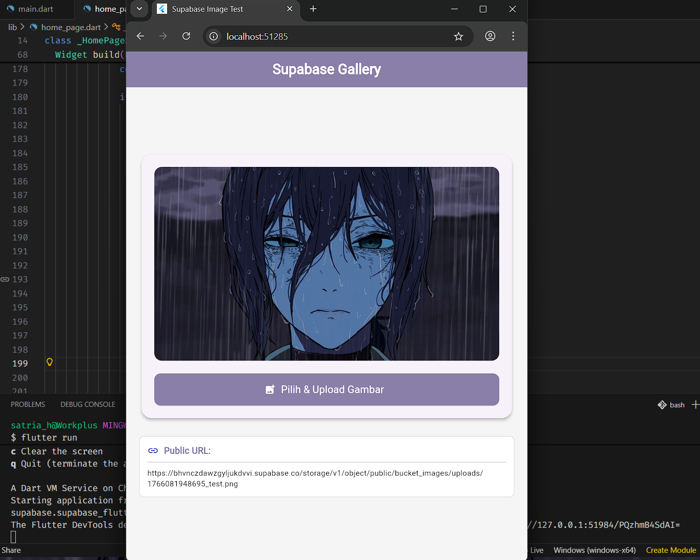

# 📸 Supabase Image Uploader (Flutter)

Aplikasi Flutter sederhana namun elegan untuk mengunggah gambar ke **Supabase Storage**. Proyek ini mendemonstrasikan integrasi antara Flutter dan Supabase dengan tampilan UI yang modern dan responsif.

## ✨ Fitur Utama

-   **Upload Gambar:** Memilih gambar dari galeri dan mengunggahnya ke bucket publik Supabase.
-   **Cross-Platform:** Mendukung **Mobile (Android/iOS)** dan **Web** dengan penanganan file binary yang tepat.
-   **Modern UI:** Tampilan antarmuka yang bersih menggunakan Card layout dan warna kustom Lavender (`#8A7FA8`).
-   **Responsive Preview:** Tampilan preview gambar yang dinamis (*Auto-height*),
-   **Loading State:** Indikator progress bar saat proses upload berlangsung.

## 🛠️ Tech Stack

-   [Flutter](https://flutter.dev/) - Framework UI.
-   [Supabase](https://supabase.com/) - Backend as a Service (Storage & Database).
-   `image_picker` - Plugin untuk memilih gambar dari galeri.
-   `supabase_flutter` - SDK resmi Supabase untuk Flutter.

## 🚀 Cara Menjalankan Project

### 1. Clone Repository
    git clone https://github.com/str122-xyz/Supabase-test.git
    cd nama-repo

### 2. Install Dependencies
    flutter pub get

### 3. Konfigurasi Supabase

    await Supabase.initialize(
      url: 'MASUKKAN_SUPABASE_PROJECT_URL',
      anonKey: 'MASUKKAN_SUPABASE_ANON_KEY',
    );

### 4. Jalankan Aplikasi
    flutter run

---

## ⚙️ Setup Supabase (Backend)

Agar aplikasi berjalan lancar, pastikan kamu sudah mengatur Supabase Dashboard seperti berikut:

1.  **Buat Project Baru** di Supabase.
2.  Masuk ke menu **Storage** > **New Bucket**.
3.  Beri nama bucket: `bucket_images`.
4.  **PENTING:** Pastikan opsi **"Public Bucket"** diaktifkan.
5.  **Atur Storage Policies** (Menu Storage > Policies):
    * Buat Policy baru untuk `INSERT` (Upload):
        * *Allowed operation:* `INSERT`
        * *Target roles:* `public` (default)
        * *Policy definition:* `bucket_id = 'bucket_images'`
    * Buat Policy baru untuk `SELECT` (Read):
        * *Allowed operation:* `SELECT`
        * *Target roles:* `public` (default)
        * *Policy definition:* `bucket_id = 'bucket_images'`

---

## 📸 Screenshots

  
  

---

## 📝 Catatan

Project ini dibuat sebagai latihan implementasi **Supabase Storage** pada Flutter dengan penanganan aspek rasio gambar yang dinamis.

---

**NIM** 1123150070  
**Created by:** Satria Herlambang